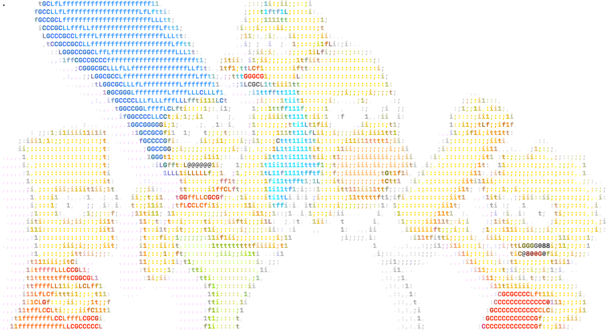
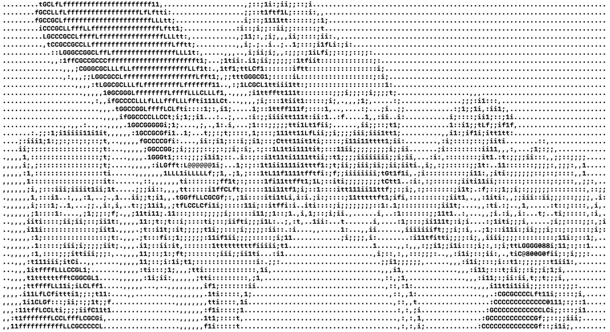
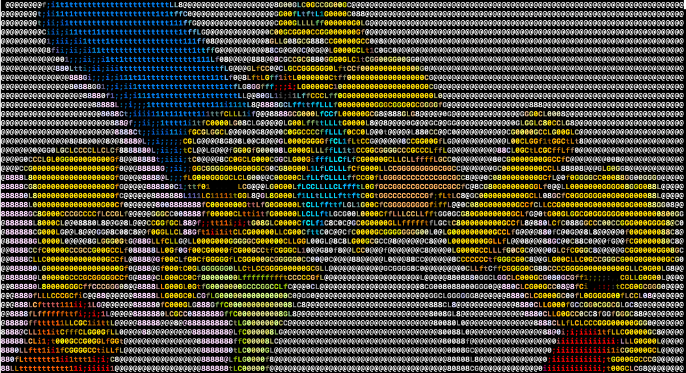

# image2text

An image converter that will convert an image to an ascii images.
It can work in black & white or color.

## Usage

```
Usage: image2ascii [OPTIONS] [FILE]
convert an image to ascii art

  -f,  --file <file>              the image filename you want to conver
  -h,  --height <height>          the height of the output ascii art
  -w,  --width <width>            the width of the output ascii art
  -c,  --color <colormode>        the color mode of the output ascii art (bw, ansi or truecolor)
  -i,  --inverted                 Invert the pixels
  -p,  --pixel <pixel>            the pixel mode of the output ascii art (ascii, ascii2 or unicode)
  -cp, --custom-pixel <pixel>     the custom pixel of the output ascii art
  -cr, --char-size-ratio <ratio>  the char size ratio of the output ascii art
```
### height & width

You can specify the height and/or width of the output ascii art.
If you don't specify them, the program will use original size of the image 
with one character per pixel.
If you only specify one of them, the program will keep the ratio of the image and use the char size ratio.

### char size ratio

Because pixels are square, but characters are not, you can choose a ratio between width and height of the characters.
By default, the program will use a ratio of 2.05. You can choose another ratio by using the "-cr" option.

### color

By default, the program will use the color mode "ansi" with 256 colors.
It can also use black & white mode or even truecolor if your terminal supports 24bits color.
It is also possible to choose a background color.

### background color

You can choose a background color by using the "-bg" option.
The color codes are ansi color codes. You can find them here: https://en.wikipedia.org/wiki/ANSI_escape_code#Colors

### Inverted

You can choose to invert the image. In that case the character density will inverted.

## Examples

```bash
image2ascii -f example/simpsons.jpg
```



```bash
image2ascii -i -c bw -f example/simpsons.jpg
```


```bash
image2ascii -bg 40 -f example/simpsons.jpg
```


In that case you will create a 

## Licence

The project is released under MIT licence